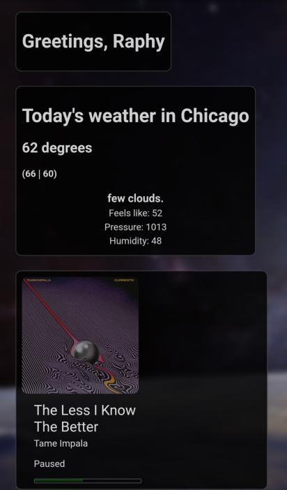

# hub-app

React app created for the Code sprint class

Hub is a dashboard that features cards that display information important for our daily lives. Instead of checking several apps, why not check only one? That's the purpose behind Hub

Such as:

- Weather (displays the current weather)
- Spotify (Shows your current song, in future builds a full media controller for spotify will be added)
- Calendar*
- To-do*
- Emails*

Hub can be used on any browser (PC or mobile)

Next version will include

- Calendar
- To-do
- Credentials to import your information to other devices.

(* Feature not available on the alpha build.)
