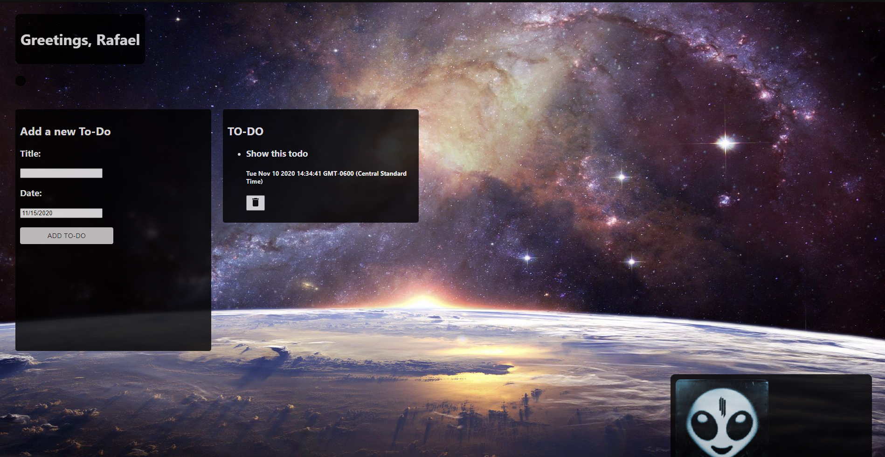

# hub-app

NEW IN VERSION 0.3

USER LOGINS NOW PROPERLY IMPLEMENTED, USERS CAN NOW CHANGE THEIR CITY WHENEVER THEY WANT
ACCOUNT PAGE
ELECTRON APP (NOW IT WORKS ON DESKTOP)

React app created for the Code sprint class

Hub is a dashboard that features cards that display information important for our daily lives. Instead of checking several apps, why not check only one? That's the purpose behind Hub

Such as:

- Weather (displays the current weather)
- Spotify (Shows your current song, in future builds a full media controller for spotify will be added)
- To-do (You can add a list of To-Dos)

Hub can be used on any browser (PC or mobile)

